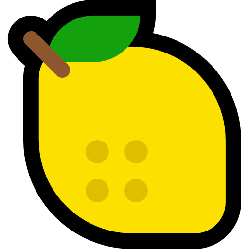

# ☕ CoffeeGen - Calculadora Método 4:6 de Tetsu Kasuya

<div align="center">
  


**Uma aplicação web para calcular as proporções e tempos para o método de preparo de café 4:6 desenvolvido por Tetsu Kasuya.**

[🌐 Acessar Site](https://coffeegen.vercel.app/) | [📝 Reportar Bug](https://github.com/pedrogottardi/tetsukasuya/issues) | [✨ Solicitar Recurso](https://github.com/pedrogottardi/tetsukasuya/issues)

</div>

## 📋 Sobre o Projeto

O método 4:6 de Tetsu Kasuya é uma técnica de preparo de café que divide a extração em duas fases principais:
- **Fase 1 (40%)**: Determina a acidez e doçura
- **Fase 2 (60%)**: Determina o corpo e força

Esta aplicação facilita o cálculo das proporções e tempos, guiando o usuário durante todo o processo de preparo.

## ✨ Funcionalidades

<div align="center">
  <table>
    <tr>
      <td align="center"><br>Mais Acidez</td>
      <td align="center"><br>Mais Doçura</td>
      <td align="center"><br>Equilibrado</td>
    </tr>
    <tr>
      <td align="center"><br>Mais Corpo</td>
      <td align="center"><br>Menos Corpo</td>
      <td align="center"><br>Padrão</td>
    </tr>
  </table>
</div>

- 🧮 Cálculo automático da proporção café/água
- 🍋 Personalização de sabor (mais acidez, mais doçura ou equilibrado)
- 💪 Personalização de corpo (mais corpo, menos corpo ou padrão)
- ⏱️ Cronômetro interativo com passos guiados
- 📱 Design responsivo para desktop e dispositivos móveis

## 🛠️ Tecnologias Utilizadas

-  HTML5
-  CSS3
-  JavaScript (Vanilla)

## 🚀 Como Usar

1. Acesse o site: [https://coffeegen.vercel.app/](https://coffeegen.vercel.app/)
2. Defina a quantidade de café desejada
3. Escolha suas preferências de sabor e corpo
4. Siga o cronômetro para preparar seu café

## 📋 Pré-requisitos

- Navegador web moderno (Chrome, Firefox, Safari, Edge)

## 💻 Instalação Local

Para executar este projeto localmente:

1. Clone o repositório:
   ```bash
   git clone https://github.com/pedrogottardi/tetsukasuya.git
   ```
2. Navegue até a pasta do projeto:
   ```bash
   cd tetsukasuya
   ```
3. Abra o arquivo `index.html` em seu navegador

## 🤝 Contribuindo

Contribuições são bem-vindas! Para contribuir:

1. Faça um Fork do projeto
2. Crie uma Branch para sua Feature (`git checkout -b feature/AmazingFeature`)
3. Faça commit das suas mudanças (`git commit -m 'Add some AmazingFeature'`)
4. Faça Push para a Branch (`git push origin feature/AmazingFeature`)
5. Abra um Pull Request

## 📝 Licença

Este projeto está sob a licença MIT. Veja o arquivo [LICENSE](LICENSE) para mais detalhes.

## 👤 Autor

**Pedro Gottardi**

- Website: [coffeegen.vercel.app](https://coffeegen.vercel.app/)
- GitHub: [@pedrogottardi](https://github.com/pedrogottardi)
- Email: [pedrocerf@gmail.com](mailto:pedrocerf@gmail.com)

## 📄 Direitos Autorais

© 2025 Pedro Gottardi. Todos os direitos reservados.

---

<div align="center">
  
⭐️ [Dê uma estrela se este projeto te ajudou!](https://github.com/pedrogottardi/tetsukasuya)

</div>